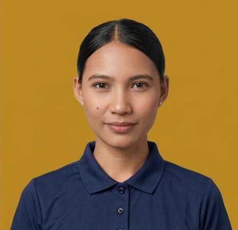
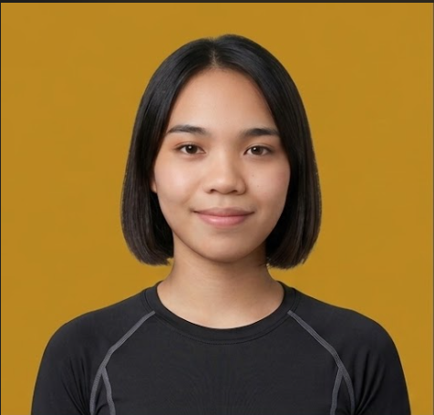
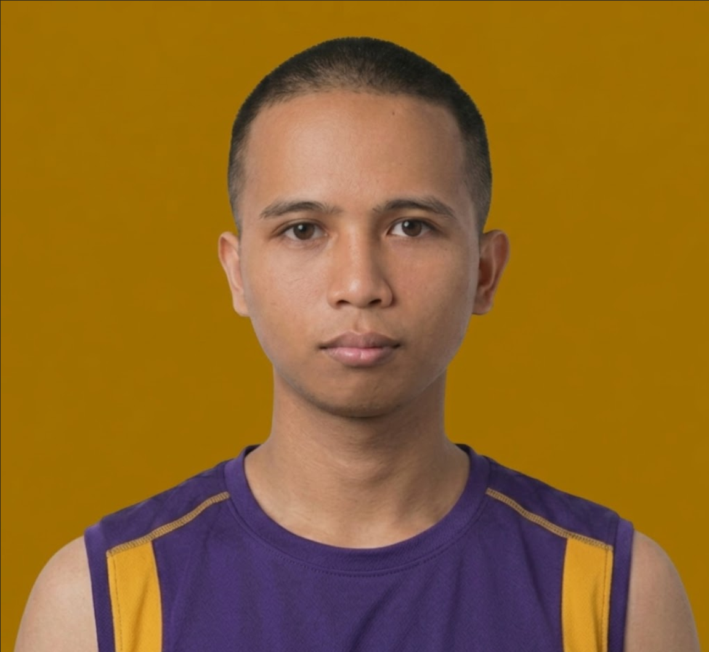

<p align="center">
  
</p>

<h1 align="center">Core Fitness</h1>

<p align="center">
  <strong>AI-Assisted Gym Management System</strong><br/>
  Rule-Based Analytics • NLP Administrative Support • Role-Based Access Control
</p>

<p align="center">
  
  
  
  
  
</p>

---

## About

**Core Fitness** is a cross-platform Management Information System designed for local fitness centers in Mamburao, Occidental Mindoro. It streamlines gym operations through automated attendance tracking, centralized member management, rule-based retention analytics, and an NLP-powered chatbot for member support.

Built as a capstone project at the **University of Occidental Mindoro**.

---

## Applications

| Application | Port | Platform | Description |
|-------------|------|----------|-------------|
| **Admin Dashboard** | `5174` | Desktop Web | Full gym management — members, trainers, schedules, analytics, settings |
| **Member & Trainer App** | `5173` | Mobile Web (375×812) | Unified app with role-based interfaces for members and trainers |

---

## Quick Start

```bash
# Clone the repository
git clone https://github.com/lealorenzana/CoreFitness.git
cd CoreFitness

# Start Admin Dashboard
cd g-fitness-admin
npm install
npm run dev
# → http://localhost:5174

# Start Member/Trainer App (in a new terminal)
cd g-fitness-member
npm install
npm run dev
# → http://localhost:5173
```

---

## User Roles (RBAC)

| Role | Access | How to Login |
|------|--------|--------------|
| **Admin** | Full system control | `localhost:5174/admin/login` → click Login |
| **Member** | Workouts, bookings, progress, QR | `localhost:5173` → Login → select **Member** |
| **Trainer** | Classes, members, bookings, schedule | `localhost:5173` → Login → select **Trainer** |

### Account Flow

```
┌─────────────────────────────────────────────────────────┐
│  MEMBER: Self-register → Pending → Admin approves → Active  │
│  TRAINER: Admin creates account with credentials → Trainer logs in │
│  ADMIN: Pre-configured account                              │
└─────────────────────────────────────────────────────────┘
```

---

## Features

### Admin Dashboard
- 📊 Business intelligence dashboard with KPI cards, charts, and activity heatmap
- 👥 Member management with pending registration approval flow
- 🏋️ Trainer management with login credential creation
- 📅 Class scheduling with conflict detection and trainer availability
- ✅ 3-column attendance: QR scan + manual check-in + log
- 📈 Rule-based retention analytics (auto-detects at-risk members)
- 💰 Revenue reports and membership plan management
- 🎉 Event management with attendee tracking
- ⚙️ 8-tab settings panel (Gym Info, Plans, Notifications, Security, Appearance, Admins, Backup)

### Member App
- 📱 Secure time-limited QR code for gym entry
- 🏆 8-tab Progress Hub (body, workouts, charts, goals, attendance, membership, badges, trainer feedback)
- 📅 Book trainer sessions
- 🤖 NLP-powered AI fitness chatbot
- 🎯 Goal tracking with milestone alerts and gamification badges
- 📋 Event viewing and registration

### Trainer App
- 🏠 Dashboard with today's classes, stats, and recent activity
- 👥 View assigned members and add workout recommendations
- 📅 Toggle own availability and view class schedule
- ✅ Accept/decline booking requests

---

## Tech Stack

| Layer | Technology |
|-------|-----------|
| UI Framework | React 18 + TypeScript |
| Build Tool | Vite 5 |
| Styling | Tailwind CSS 3 + CSS Variables |
| Animations | Framer Motion |
| Charts | Recharts |
| Icons | Lucide React |
| Routing | React Router v6 |
| Data Layer | localStorage (SharedStorage utility) |

---

## Project Structure

```
CoreFitness/
├── g-fitness-admin/        # Admin dashboard (desktop)
│   ├── src/pages/          # 12 admin pages
│   ├── src/components/     # Reusable UI components
│   └── public/             # Static assets (logos, trainer photos)
│
├── g-fitness-member/       # Member & Trainer app (mobile)
│   ├── src/pages/          # Member pages + trainer/ subfolder
│   ├── src/pages/trainer/  # 5 trainer-specific pages
│   ├── src/pages/progress/ # 8-tab progress hub
│   └── public/             # Static assets (gym photos, profile pics)
│
├── assets/                 # Shared source images
└── docs/                   # Documentation
    ├── SYSTEM_DOCUMENTATION.md
    ├── SETUP_GUIDE.md
    ├── DEFENSE_GUIDE.md
    └── PROJECT_STRUCTURE.md
```

---

## Screenshots

| Admin Dashboard | Member App | Trainer App |
|:-:|:-:|:-:|
| KPI cards, charts, heatmap | QR code, progress hub | Classes, bookings, members |

---

## Documentation

| Document | Description |
|----------|-------------|
| [System Documentation](docs/SYSTEM_DOCUMENTATION.md) | Complete system overview — architecture, features, data flow |
| [Setup Guide](docs/SETUP_GUIDE.md) | Installation, credentials, troubleshooting |
| [Defense Guide](docs/DEFENSE_GUIDE.md) | Capstone demo flow, talking points, panel Q&A |
| [Project Structure](docs/PROJECT_STRUCTURE.md) | Detailed file tree with descriptions |

---

## Design System

| Element | Specification |
|---------|--------------|
| Primary Color | `#7C3AED` (Violet) |
| Secondary Color | `#F59E0B` (Yellow) |
| Background | `#0F0F1A` (Dark) |
| Theme | Dark only, flat colors, no gradients |
| Buttons | Pill-shaped (rounded-full), 40px height |
| Mobile Frame | 375×812px with status bar and notch |

---

## Trainers

| Name | Specialization | Photo |
|------|---------------|:-----:|
| Cyrelle Joy Duhac | Strength & Conditioning |  |
| Ana Par Iturralde | HIIT & Cardio |  |
| Nathanniel Ucol | Boxing & Functional Training |  |

---

## License

This project is developed for academic purposes as a capstone requirement.

---

<p align="center">
  <strong>Core Fitness</strong> — Capstone Project<br/>
  University of Occidental Mindoro • 2024–2026
</p>
